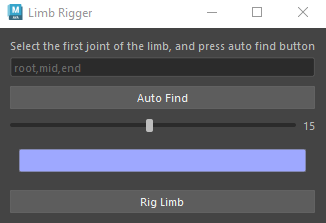

# My Maya Plugins

## Limb Rigger

[Github](https://github.com/FreezyDev07/MayaPlugins2025Spring)

this plugin rigs any 3 joint limb with ik, fk and ikfk blend.

* support auto joint finding
* controller size control
* controller color control

# Proxy Generator

Uses vertices in proximity to joints to duplicate and split the mesh into separate segments.

